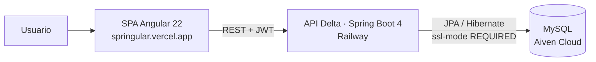

# Springular — Frontend Angular del Sistema de Vacunación


SPA en Angular que digitaliza la experiencia de vacunación de punta a punta: los ciudadanos consultan su **carnet digital**, sus vacunas aplicadas y pendientes, el personal de salud registra dosis y consulta inventario e historial clínico, y los administradores gestionan el personal y auditan cada acción — todo consumiendo la [API Delta](https://github.com/itHanslee/backspring) desplegada en Railway.

## 🌍 Demo en vivo

| Componente | URL | Estado |
|---|---|---|
| Frontend Angular (este repo) | [springular.vercel.app](https://springular.vercel.app) | 🟢 Producción |
| API REST Delta (repo aparte) | [backspring-production-c157.up.railway.app](https://backspring-production-c157.up.railway.app) | 🟢 Producción |

## ✨ Características

- **Doble acceso**: login independiente para ciudadanos (`login-ciudadano`) y personal autorizado (`login-staff`).
- **Carnet digital** — el ciudadano consulta su historial completo de vacunación.
- **Vacunas aplicadas y pendientes** — cálculo de próximas dosis según los esquemas de dosificación del backend.
- **Recordatorios** — seguimiento del ciclo de vida de cada recordatorio.
- **Panel de personal de salud** — gestión de ciudadanos, registro de vacunaciones, inventario, historial clínico y reportes.
- **Panel de administración** — auditorías globales, registro de personal de salud y gestión de vacunas.
- **Arquitectura moderna** — componentes standalone, estado local con **Signals**, rutas lazy con `loadComponent`.
- **Seguridad por capas** — interceptor JWT + guards de autenticación y rol en cada módulo privado.

## 🏛️ Arquitectura



Organización por responsabilidades:

| Módulo | Responsabilidad |
|---|---|
| `core/services` | Comunicación HTTP con la API: `auth`, `ciudadano`, `vacuna`, `vacunacion`, `esquema-vacunacion`, `recordatorios`, `personal-salud`, `administrador`, `auditoria` |
| `core/guards` | Protección de rutas: `auth-guard` (sesión) y `role-guard` (rol + redirección) |
| `core/interceptors` | Inyección automática del token JWT en cada petición |
| `feature/ciudadano` | Carnet, vacunas aplicadas/pendientes, recordatorios |
| `feature/personal_salud` | Ciudadanos, registrar vacunación, inventario, historial clínico, reportes |
| `feature/administrador` | Auditorías globales, personal de salud, gestión de vacunas |
| `feature/public` | Landing pública: home, nosotros, soporte, esquema nacional |
| `shared` | Componentes reutilizables (`data-table`, headers), modelos y utilidades |

## 💻 Stack tecnológico

| Tecnología | Versión | Uso |
|---|---|---|
| Angular | ^22.0.0 | Framework (standalone components, Signals, Router lazy) |
| TypeScript | ~6.0.2 | Lenguaje |
| RxJS | ~7.8.0 | Reactividad y flujos asíncronos |
| Vitest | ^4.0.8 | Pruebas unitarias (~37 specs) vía `@angular/build:unit-test` |
| Prettier | ^3.8.1 | Formato de código |

## 📁 Estructura del proyecto

> La aplicación vive dentro de `sistema_de_vacunacion/`.

```text
sistema_de_vacunacion/
├── src/
│   ├── app/
│   │   ├── core/
│   │   │   ├── guards/               # auth-guard.ts · role-guard.ts
│   │   │   ├── interceptors/         # auth-interceptor.ts (JWT)
│   │   │   ├── models/               # auth.model.ts (LoginResponse)
│   │   │   └── services/             # Servicios HTTP por dominio
│   │   ├── feature/
│   │   │   ├── administrador/        # Layout + auditorías, vacunas, personal
│   │   │   ├── auth/                 # login-ciudadano · login-staff
│   │   │   ├── ciudadano/            # Layout + carnet, dosis, recordatorios
│   │   │   ├── personal_salud/       # Layout + ciudadanos, vacunación, inventario,
│   │   │   │                         # historial, reportes
│   │   │   └── public/               # Home, nosotros, soporte, esquema
│   │   ├── shared/
│   │   │   ├── components/           # app-header · app-sidebar · data-table
│   │   │   ├── models/               # Modelos de dominio compartidos
│   │   │   └── utils/                # fecha.utils.ts
│   │   ├── app.config.ts             # HttpClient + interceptores globales
│   │   └── app.routes.ts             # Rutas lazy por rol
│   ├── environments/
│   │   └── environment.ts            # apiUrl + mapa central de endpoints
│   ├── styles.css
│   └── index.html
├── angular.json
├── package.json
└── vercel.json                       # Deploy SPA en Vercel
```

## 🔐 Autenticación y roles

1. El login se realiza contra `/api/auth/login` del backend, que devuelve un `LoginResponse { token, tipoToken, email, rol }`.
2. La sesión se persiste en `localStorage` bajo la clave `delta_sesion`.
3. Un interceptor funcional (`HttpInterceptorFn`) agrega `Authorization: Bearer <token>` a todas las peticiones — excepto al propio login — y limpia la sesión si detecta un token corrupto.
4. Las rutas privadas están protegidas con `authGuard` y `roleGuard('ROL')`, todas cargadas de forma diferida con `loadComponent`.

| Rol | Prefijo de ruta | Acceso |
|---|---|---|
| `CIUDADANO` | `/ciudadano` | Carnet, vacunas aplicadas/pendientes, recordatorios |
| `PERSONAL_SALUD` | `/personal-salud` | Ciudadanos, vacunaciones, inventario, historial, reportes |
| `ADMINISTRADOR` | `/administrador` | Auditorías globales, personal de salud, vacunas |

Cualquier ruta desconocida redirige a la página pública de inicio.

## 🖥️ Ejecución local

Requisitos previos: **Node.js 20+** y **npm** (el repo declara `npm@11`).

```bash
git clone https://github.com/itHanslee/Springular.git
cd Springular/sistema_de_vacunacion
npm install
npm start
```

Abrí [http://localhost:4200](http://localhost:4200). La app necesita el backend accesible; para desarrollo local podés levantar la [API Delta](https://github.com/itHanslee/backspring).

### Scripts disponibles

| Script | Acción |
|---|---|
| `npm start` | Servidor de desarrollo (`ng serve`) |
| `npm run build` | Build de producción en `dist/sistema_de_vacunacion/browser` |
| `npm run watch` | Build en modo desarrollo con recarga |
| `npm test` | Pruebas unitarias con **Vitest** |

## ⚙️ Configuración

La URL base de la API se define en `src/environments/environment.ts`:

```ts
export const API_BASE_URL = {
  production: false,
  apiUrl: 'https://backspring-production-c157.up.railway.app'
};
```

Además, ese archivo concentra un mapa `API` con la ruta de cada módulo del backend (`AUTH`, `USUARIOS`, `CIUDADANOS`, `VACUNAS`, `VACUNACIONES`, `REPORTES`, `AUDITORIA`, `RECORDATORIOS`, etc.). **Convención: nunca hardcodear URLs en componentes o servicios** — siempre consumir desde este mapa.

## ☁️ Deploy

El deploy de producción corre en **Vercel**, guiado por `vercel.json`:

- **Build**: `npm run build`.
- **Output**: `dist/sistema_de_vacunacion/browser`.
- **Rewrite** `/(.*) → /index.html`: imprescindible para que las rutas profundas de la SPA (ej. `/ciudadano/carnet`) funcionen al recargar o abrir directo.

El backend vive en Railway y la base MySQL gestionada en Aiven Cloud — ver el [repo de la API](https://github.com/itHanslee/backspring).

## 🤝 Contribución

1. Hace fork y creá una rama por feature o fix.
2. Mantené los componentes standalone y el estado con Signals.
3. No dupliques URLs de endpoints: usá el mapa de `environment.ts`.
4. Respetá guards y roles por módulo.
5. Enviá tu PR con una descripción clara del cambio.

## 📄 Licencia

Distribuido bajo la licencia [MIT](https://opensource.org/licenses/MIT).

---

Este README es el punto de entrada del frontend: instalación, configuración, arquitectura y convenciones del Sistema de Vacunación.
